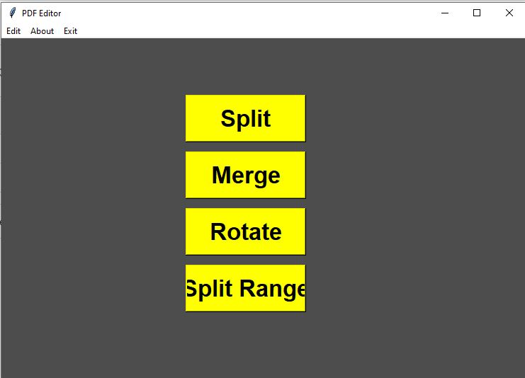
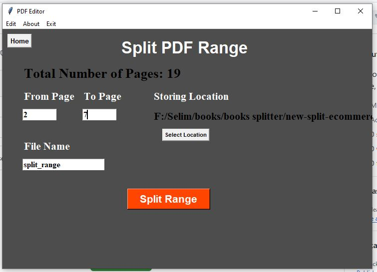

Python Script that merge, split page by page, split by range, rotate PDF file.https://github.com/Selim9-9/PDF-Editor/tree/main
the source code is from Pyseek , but I made some fixes and new options to it by Cluad AI

